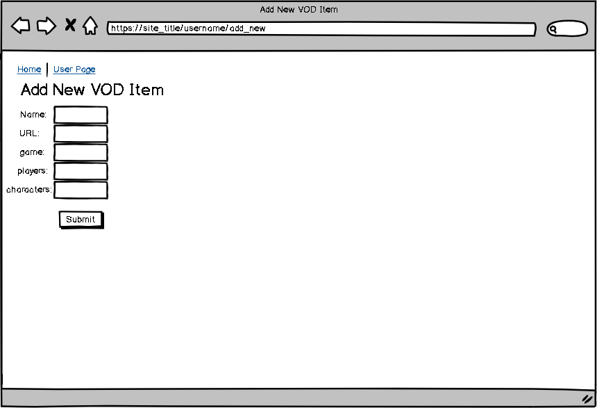
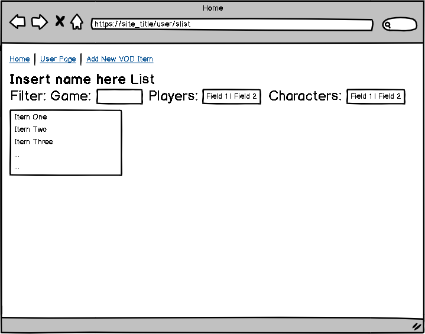
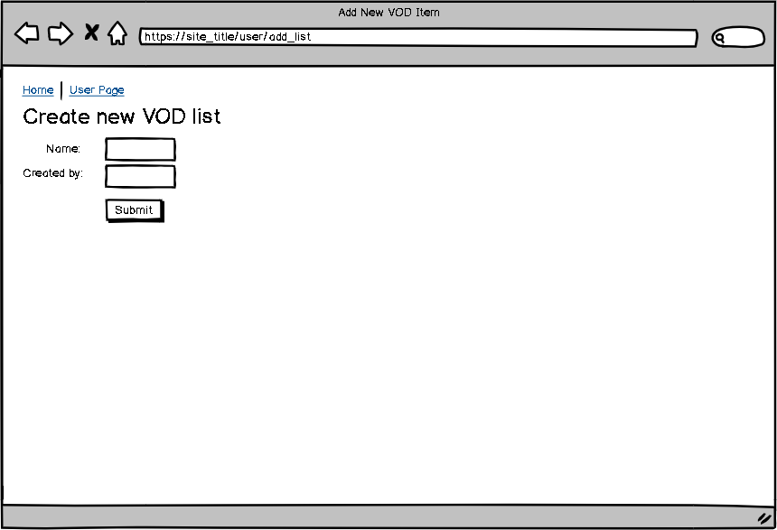

# VOD Review (working title)

## Overview

As a competitor in a fighting game, one of the most useful tools for improvement is reviewing footage of your matches, or a VOD (side note: usually, players also study VODs they are not personally featured in). But more often than not, your VODs are not always in the same place, which can make it annoying to review multiple VODS in the same session.

VOD Review (working title) is a web app that will allow users to keep track of their VODs. Users can register and login. Once they're logged in, they can create or view their VOD lists. For every list, users can add items. Users can filter lists by certain parameters (game, players, characters).


## Data Model

The application will store Users, Lists and Items

* each user can have multiple lists
* each list can have multiple items (by embedding)
* each list can be filtered by certain parameters (game, players, characters)
  * the filtering for players and characters can be as follows:
    * you can filter by just one player/character 
    * you can filter by two players/characters, but you can specify whether you're looking for items that have both players/characters or just one of them 


An Example User:

```javascript
{
  username: "fightingfred",
  password: // a password,
  lists: // an array of references to List documents
}
```

An Example List with Embedded Items:

```javascript
{
  user: // a reference to a User object
  name:
  items: [
    { title: "KJH vs Ginger - Melee Singles Top 48: Losers Round 4 - Full Bloom 5", url: "https://www.youtube.com/watch?v=sqejT7uo5eA", game: "Super Smash Bros. Melee", players: ["Ginger", "KJH"], chars: ["Falco", "Fox"]},
    { name: "ZeRo vs Armada - Singles Bracket: Losers' Round 1 - Smash Ultimate Summit | Wolf vs Inkling", url: "https://www.youtube.com/watch?v=qo2UUed_p24&t=1428s", game: "Super Smash Bros. Ultimate", players: ["ZeRo", "Armada"], chars: ["Wolf", "Inkling"]},
  ]
}
```


## [Link to Commented First Draft Schema](db.js) 

## Wireframes

/[site_title]/user/add_new - page for creating a new VOD item



/[site_title] - home page (page for creating / logging into account)


/[site_title]/user - page for showing user's VOD lists


/[site_title]/user/slist - page for showing a single list



/[site_title]/user/newlist - page for creating a new list




## Site map


## User Stories or Use Cases

1. as non-registered user, I can register a new account with the site.
2. as a user, I can log in to the site.
3. as a user, I can create a new VOD item.
4. as a user, I can view all of the VOD items I've created in a single list
5. as a user, I can create new VOD lists.
6. as a user, I can view all of the lists I created in a single list.

## Research Topics

* (3 points) Unit testing with JavaScript - Mocha
* (2 points) Use a CSS framework throughout the site - Bootstrap
* (3 points) Configuration management - nconf

* 8 points out of the required 8 points


## [Link to Initial Main Project File](app.js) 

## Annotations / References Used
