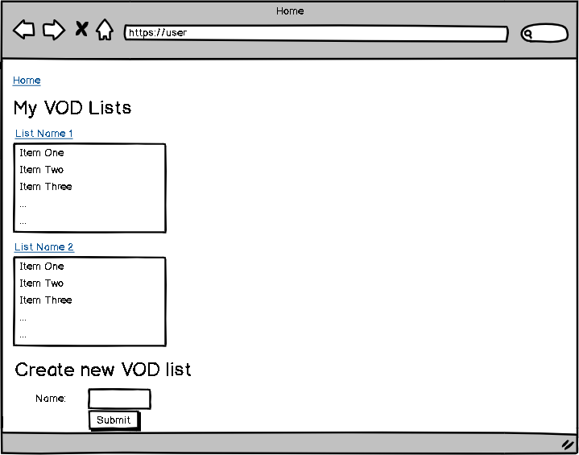
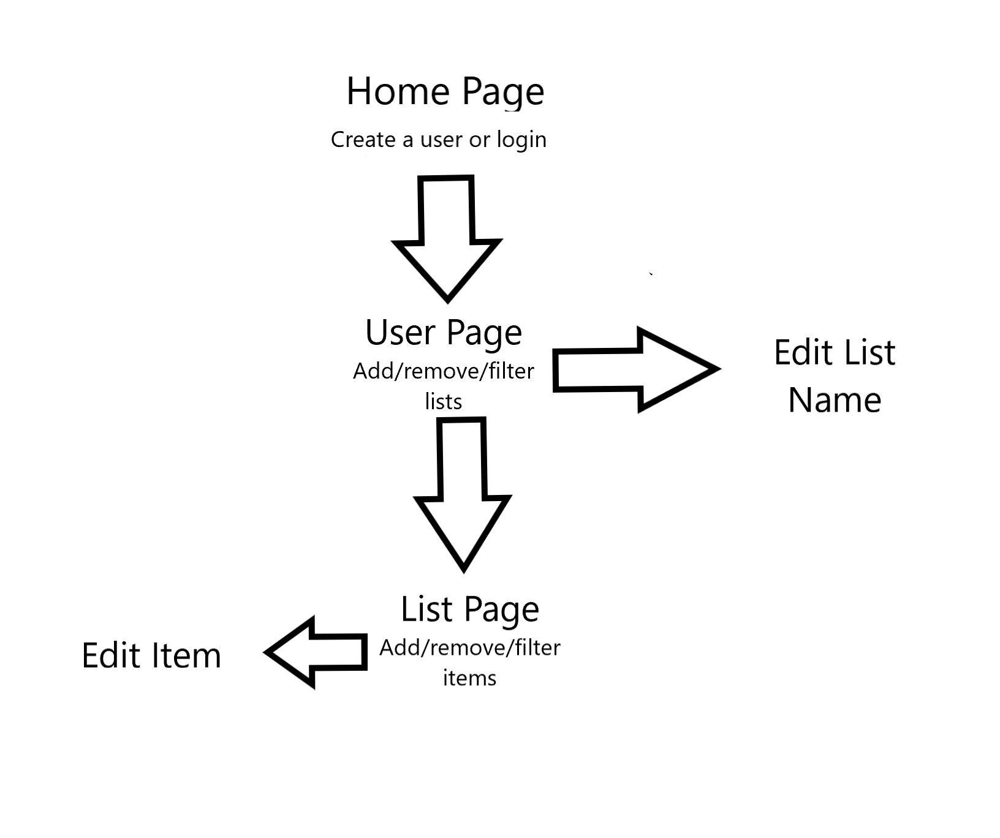

# VOD Review Center

## Overview

As a competitor in a fighting game, one of the most useful tools for improvement is reviewing footage of your matches, or a VOD (side note: usually, players also study VODs they are not personally featured in). But more often than not, your VODs are not always in the same place, which can make it annoying to review multiple VODS in the same session.

VOD Review Center is a web app that will allow users to keep track of their VODs. Users can register and login. Once they're logged in, they can create or view their VOD lists in a list of lists. This list of lists can be filtered by name. The names of lists can be edited. In every list, users can add and remove items. Items in a list can be edited and filtered by their properties (name,url, game, players, characters).


## Data Model

The application will store Users, Lists and Items

* each user can have multiple lists (via references)
* each list can have multiple items (by embedding)


An Example User:

```javascript
{
  username: "fightingfred",
  password: // a password,
  lists: // an array of references to List documents
}
```

An Example List with Embedded Items:

```javascript
{
  user: // a reference to a User object
  name: // a name for the List
  items: [
    { name: "KJH vs Ginger - Melee Singles Top 48: Losers Round 4 - Full Bloom 5", url: "https://www.youtube.com/watch?v=sqejT7uo5eA", game: "Super Smash Bros. Melee", players: ["Ginger", "KJH"], chars: ["Falco", "Fox"]},
    { name: "ZeRo vs Armada - Singles Bracket: Losers' Round 1 - Smash Ultimate Summit | Wolf vs Inkling", url: "https://www.youtube.com/watch?v=qo2UUed_p24&t=1428s", game: "Super Smash Bros. Ultimate", players: ["ZeRo", "Armada"], chars: ["Wolf", "Inkling"]},
  ]
}
```


## [Link to Commented First Draft Schema](db.js) 

## Wireframes

/user/listname - page for seeing List "listname" and adding items


/[site_title] - home page (page for creating / logging into account)


/user - page for showing user's VOD lists



/user/edit/listname - page editing List "listname"


/user/listname/edit/itemname - page editing Item "itemname" in List "listname"


## Site map



## User Stories or Use Cases

1. as non-registered user, I can register a new account with the site.
2. as a user, I can log in to the site.
3. as a user, I can create and remove VOD lists.
4. as a user, I can view all of the lists I created in a single list.
5. as a user, I can edit the names of VOD lists and filter the lists of lists by name.
6. as a user, I can create add and remove VOD items.
7. as a user, I can filter a list by properties of VOD items.
8. as a user, I can edit VOD items in a list.


## Research Topics

* (3 points) Unit testing with JavaScript - Mocha
  * Tested helper functions that don't require request or response objects
  * see [tests/test.js](tests/test.js) for the unit tests
  * see [tests/run.png](tests/run.png) for test results
* (2 points) Use a CSS framework throughout the site - Bootstrap
  * Customized a theme on top of stock Bootstrap
  * see [main.scss](public/css/main.scss) 
* (3 points) Configuration management - nconf
  * Used nconf for configuration management

* 8 points out of the required 8 points


## [Link to Initial Main Project File](app.js) 

## [Annotations / References Used](resources.txt)
